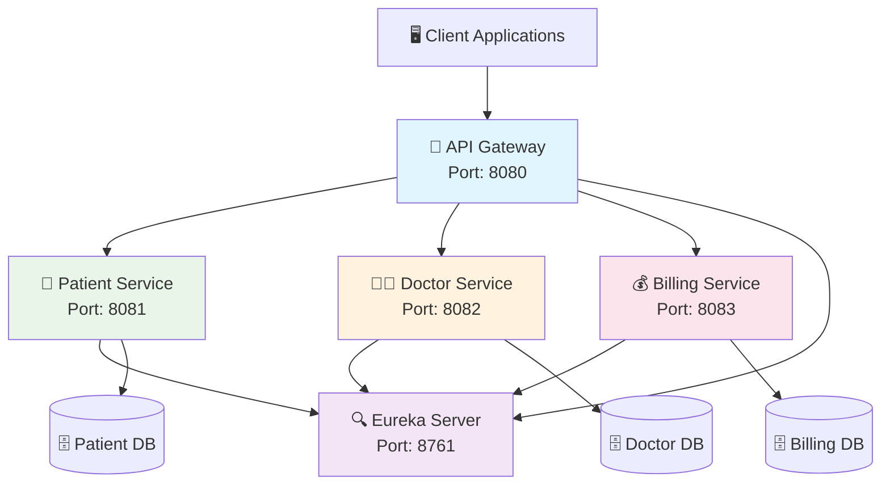

# 🏥 HealthPlus
### *A Modern Microservices-Based Healthcare Management System*

<div align="center">


*Transforming Healthcare Management Through Modern Architecture*

</div>

---

## 🌟 What Makes HealthPlus Special?

HealthPlus revolutionizes healthcare management by leveraging cutting-edge microservices architecture. Built with scalability, security, and maintainability at its core, it empowers healthcare providers to deliver exceptional patient care while streamlining administrative processes.

### ✨ Key Highlights

🔹 **Microservices Architecture** - Independent, scalable services that grow with your needs  
🔹 **Enterprise Security** - JWT-based authentication with Spring Security  
🔹 **Real-time Discovery** - Eureka service discovery for seamless communication  
🔹 **Intelligent Gateway** - Centralized API management and routing  
🔹 **Advanced Search** - Elasticsearch integration for lightning-fast queries  
🔹 **Production Ready** - Built with industry best practices and patterns  

---

## 🏗️ System Architecture



---

## 🛠️ Technology Stack

<table>
<tr>
<td width="50%">

### 🔧 Backend & Core
- **Java 17+** - Modern JVM language
- **Spring Boot 3.x** - Application framework
- **Spring Cloud** - Microservices toolkit
- **Spring Security** - Authentication & authorization
- **Spring Data JPA** - Data persistence layer
- **Hibernate ORM** - Object-relational mapping

</td>
<td width="50%">

### 🏗️ Architecture & Infrastructure
- **Eureka Server** - Service discovery
- **API Gateway** - Request routing & filtering
- **JWT Tokens** - Secure authentication
- **RESTful APIs** - Standard web services
- **Elasticsearch** - Advanced search capabilities
- **Maven** - Dependency management

</td>
</tr>
<tr>
<td width="50%">

### 💾 Database & Storage
- **MySQL** - Primary relational database
- **PostgreSQL** - Alternative database option
- **JPA Repositories** - Data access layer
- **Connection Pooling** - Optimized database connections

</td>
<td width="50%">

### 🛠️ Development Tools
- **IntelliJ IDEA / STS** - IDEs
- **Postman** - API testing
- **Git** - Version control
- **Docker** *(Optional)* - Containerization
- **Angular/React** *(Optional)* - Frontend frameworks

</td>
</tr>
</table>

---

## 🎯 Microservices Breakdown

<div align="center">

| 🚀 **Service** | 🎯 **Purpose** | 🔌 **Port** | 📝 **Key Features** |
|:-------------:|:---------------|:-----------:|:-------------------|
| 🏥 **Patient Service** | Patient management & profiles | `8081` | Registration, Medical History, Profile Management |
| 👨‍⚕️ **Doctor Service** | Doctor profiles & scheduling | `8082` | Specialties, Availability, Appointment Management |
| 💰 **Billing Service** | Invoice & payment processing | `8083` | Bill Generation, Payment Tracking, Insurance |
| 🚪 **API Gateway** | Request routing & security | `8080` | Load Balancing, Authentication, Rate Limiting |
| 🔍 **Eureka Server** | Service discovery | `8761` | Health Monitoring, Service Registration |

</div>

---

## 🚀 Quick Start Guide

### 📋 Prerequisites

Before you begin, ensure you have the following installed:

```bash
☑️ Java 17 or higher
☑️ Maven 3.6+
☑️ MySQL 8.0+
☑️ Git
☑️ Your favorite IDE (IntelliJ IDEA recommended)
```

### 🔧 Installation Steps

#### 1️⃣ **Clone the Repository**
```bash
git clone https://github.com/ErNitesh-d/HealthPlus-A-Microservices-Based-Healthcare-Management-System.git
cd HealthPlus-A-Microservices-Based-Healthcare-Management-System
```

#### 2️⃣ **Database Setup**
```sql
-- Create databases for each microservice
CREATE DATABASE healthplus_patient;
CREATE DATABASE healthplus_doctor;
CREATE DATABASE healthplus_billing;

-- Create user and grant permissions
CREATE USER 'healthplus'@'localhost' IDENTIFIED BY 'your_password';
GRANT ALL PRIVILEGES ON healthplus_*.* TO 'healthplus'@'localhost';
FLUSH PRIVILEGES;
```

#### 3️⃣ **Configure Application Properties**
Update `application.yml` or `application.properties` in each service:

```yaml
spring:
  datasource:
    url: jdbc:mysql://localhost:3306/healthplus_patient
    username: healthplus
    password: your_password
    driver-class-name: com.mysql.cj.jdbc.Driver
  
  jpa:
    hibernate:
      ddl-auto: update
    show-sql: true
    
eureka:
  client:
    service-url:
      defaultZone: http://localhost:8761/eureka/
```

#### 4️⃣ **Start Services in Order**

```bash
# 1. Start Eureka Server (Service Discovery)
cd eureka-server
mvn spring-boot:run

# 2. Start individual microservices
cd ../patient-microservice
mvn spring-boot:run

cd ../doctor-microservice
mvn spring-boot:run

cd ../billing-microservice
mvn spring-boot:run

# 3. Start API Gateway (Last)
cd ../gateway-api
mvn spring-boot:run
```

#### 5️⃣ **Verify Installation**

✅ **Eureka Dashboard**: http://localhost:8761  
✅ **API Gateway**: http://localhost:8080  
✅ **Patient Service**: http://localhost:8081/patients  
✅ **Doctor Service**: http://localhost:8082/doctors  
✅ **Billing Service**: http://localhost:8083/bills  

---

## 📚 API Documentation

### 🔐 Authentication Endpoints

| Method | Endpoint | Description |
|--------|----------|-------------|
| `POST` | `/auth/login` | User authentication |
| `POST` | `/auth/register` | User registration |
| `POST` | `/auth/refresh` | Refresh JWT token |

### 👥 Patient Management

| Method | Endpoint | Description |
|--------|----------|-------------|
| `GET` | `/api/patients` | Get all patients |
| `GET` | `/api/patients/{id}` | Get patient by ID |
| `POST` | `/api/patients` | Create new patient |
| `PUT` | `/api/patients/{id}` | Update patient |
| `DELETE` | `/api/patients/{id}` | Delete patient |

### 👨‍⚕️ Doctor Management

| Method | Endpoint | Description |
|--------|----------|-------------|
| `GET` | `/api/doctors` | Get all doctors |
| `GET` | `/api/doctors/{id}` | Get doctor by ID |
| `GET` | `/api/doctors/specialty/{specialty}` | Get doctors by specialty |
| `POST` | `/api/doctors` | Create new doctor |
| `PUT` | `/api/doctors/{id}` | Update doctor |

### 💰 Billing Operations

| Method | Endpoint | Description |
|--------|----------|-------------|
| `GET` | `/api/bills` | Get all bills |
| `GET` | `/api/bills/patient/{patientId}` | Get bills by patient |
| `POST` | `/api/bills` | Create new bill |
| `PUT` | `/api/bills/{id}/pay` | Mark bill as paid |

---

## 🛡️ Security Features

🔐 **JWT Authentication** - Secure token-based authentication  
🛡️ **Role-Based Access Control** - Different permissions for users  
🔒 **API Rate Limiting** - Prevent abuse and ensure stability  
🚫 **CORS Configuration** - Cross-origin request security  
🔑 **Password Encryption** - BCrypt hashing for user passwords  

---

## 📈 Monitoring & Health Checks

HealthPlus includes comprehensive monitoring capabilities:

- **Eureka Dashboard** - Service health and registration status
- **Actuator Endpoints** - Application metrics and health checks
- **Custom Health Indicators** - Database connectivity and service status
- **Logging Integration** - Centralized logging with proper log levels

Access health endpoints:
```
GET /actuator/health
GET /actuator/info
GET /actuator/metrics
```

---

## 🤝 Contributing

We welcome contributions from the community! Here's how you can help:

1. **🍴 Fork** the repository
2. **🌿 Create** a feature branch (`git checkout -b feature/amazing-feature`)
3. **💻 Commit** your changes (`git commit -m 'Add some amazing feature'`)
4. **📤 Push** to the branch (`git push origin feature/amazing-feature`)
5. **🔄 Open** a Pull Request

### 📝 Contribution Guidelines

- Follow Java coding standards and conventions
- Write comprehensive unit tests for new features
- Update documentation for any API changes
- Ensure all tests pass before submitting PR

---

## 🐛 Troubleshooting

<details>
<summary><strong>🔧 Common Issues & Solutions</strong></summary>

**Issue**: Services not registering with Eureka
```bash
# Solution: Check if Eureka server is running on port 8761
curl http://localhost:8761/eureka/apps
```

**Issue**: Database connection errors
```bash
# Solution: Verify database credentials and ensure MySQL is running
mysql -u healthplus -p -e "SHOW DATABASES;"
```

**Issue**: Port already in use
```bash
# Solution: Find and kill process using the port
lsof -ti:8080 | xargs kill -9
```

</details>

---

---

## 🎯 Roadmap

- [ ] **🔄 CI/CD Pipeline** - Automated testing and deployment
- [ ] **🐳 Docker Support** - Containerization for easy deployment  
- [ ] **☁️ Cloud Deployment** - AWS/Azure deployment guides
- [ ] **📱 Mobile API** - Enhanced mobile application support
- [ ] **📊 Analytics Dashboard** - Real-time healthcare analytics
- [ ] **🤖 AI Integration** - Machine learning for health predictions

---

## 👨‍💻 Author

**Nitesh Dagiya**  
[](https://github.com/ErNitesh-d)
[](https://linkedin.com/in/dagiya-nitesh)

---

<div align="center">

### ⭐ If you found this project helpful, please give it a star!

**Made with ❤️ for the Healthcare Community**

*Empowering Healthcare Through Technology*

</div>
